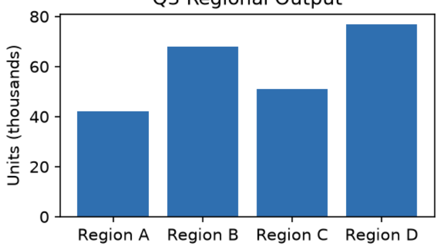

# synthetic_sample

<!-- page 1 -->

## Q3 Regional Operations Report
This report summarizes regional operational output for the third quarter. Overall throughput increased across three of the four monitored regions, driven primarily by expanded shift coverage and reduced equipment downtime.
Region B continues to lead in total output, while Region A shows the largest quarter-over-quarter improvement. Details for each region are provided in the table below.
*Table 1. Output by region, in thousands of units.*

<table border="1">
	<tr>
		<th>Region</th>
		<th>Q2</th>
		<th>Q3</th>
		<th>Change</th>
	</tr>
	<tr>
		<td>Region A</td>
		<td>31</td>
		<td>42</td>
		<td>+35%</td>
	</tr>
	<tr>
		<td>Region B</td>
		<td>60</td>
		<td>68</td>
		<td>+13%</td>
	</tr>
	<tr>
		<td>Region C</td>
		<td>55</td>
		<td>51</td>
		<td>-7%</td>
	</tr>
	<tr>
		<td>Region D</td>
		<td>70</td>
		<td>77</td>
		<td>+10%</td>
	</tr>
</table>
Efficiency = Output / (Hours x Headcount)
*q3 regional output*

*A bar chart titled "Q5 Regional Output" displays four regions (Region A, B, C, D) with corresponding unit values ranging from 40 to 80,000 units.*
Eq. 1. Efficiency ratio used for regional comparison.
*Figure 1. Regional output, Q3.*

*A blue zigzag line representing a graph or waveform.*
J. Alvarez, Regional Director
Internal use only | Page 1 of 1 | Doc ID: SAMPLE-2026-Q3-001
